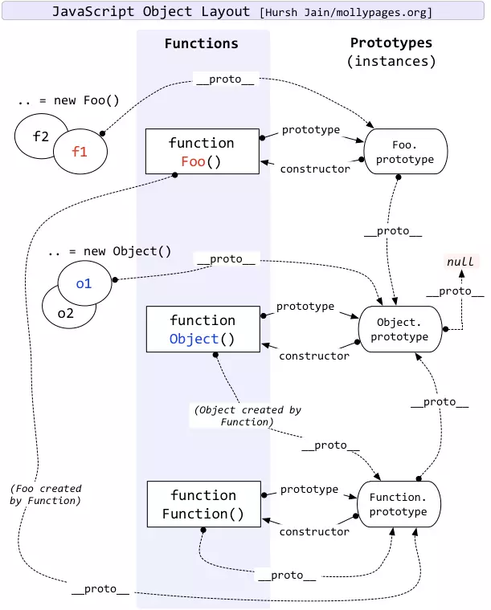

## 原型

①所有引用类型都有一个__proto__(隐式原型)属性，属性值是一个普通的对象   
②所有函数都有一个prototype(原型)属性，属性值是一个普通的对象   
③所有引用类型的__proto__属性指向它构造函数的prototype

## 原型链

当访问一个对象的某个属性时，会先在这个对象本身属性上查找，如果没有找到，则会去它的__proto__隐式原型上查找，即它的构造函数的prototype，如果还没有找到就会再在构造函数的prototype的__proto__中查找，这样一层一层向上查找就会形成一个链式结构，我们称为原型链。

