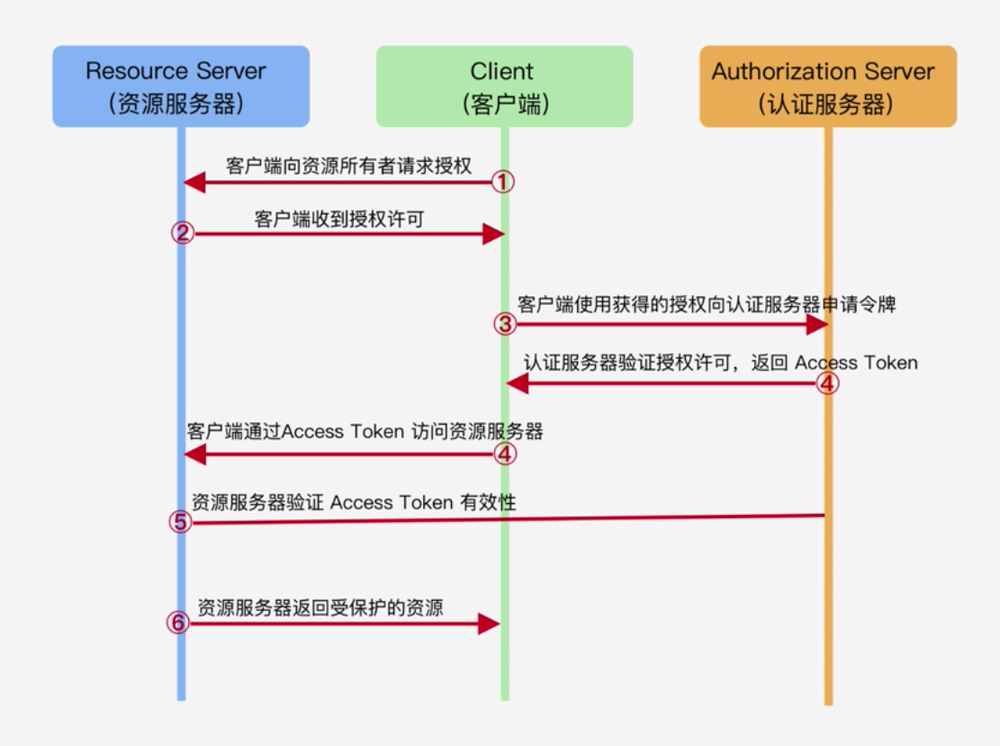
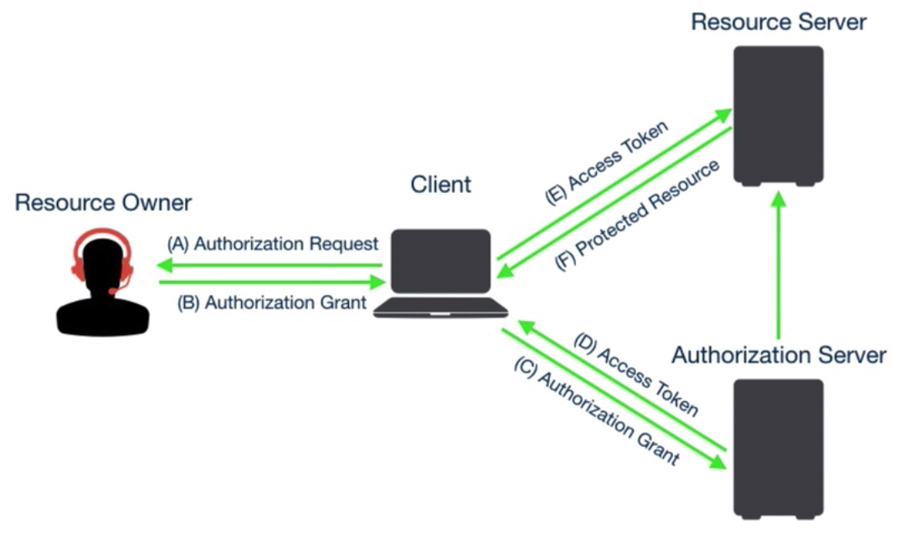
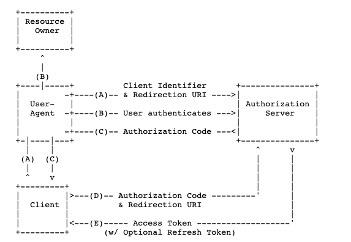

## OAuth2.0

#### 什么是OAuth2.0

Oauth2.0授权框架使得第三方应用可以访问该用户在某一网站上存储的信息，无需将用户名和密码提供给第三方应用  

举例：抖音去微信服务器获取用户的微信头像、昵称、好友列表等  

#### 为什么要用OAuth

传统的授权方式缺点：  
第三方要存储你的用户名密码，不安全  
第三方将可以访问所有的资源，而实际上它只应当访问有权限访问的资源  
如果用户名修改密码，所有的第三方授权都会失效  

#### 基本原理

### 四种授权方式

#### 授权码模式  

#### 简化模式
去掉获取授权码的流程  
适合没有后台的第三方  不推荐使用前端直接和授权服务器交互，请求参数可以伪造，谁都可以拿到accesstoken，存在安全问题，不推荐使用
#### 密码模式
需要将用户名密码提供给客户端  
适合用户信任第三方  
需要将密码传给第三方  

#### 客户端模式

适合没有前端，只存在客户端与服务器交互，整个过程没有用户参与
